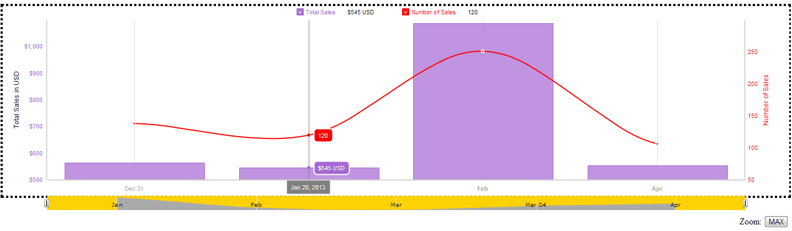

# amCharts Accessibility Plugin
## by the PayPal Accessibility Team
See the [Authors](#authors) section below for more information.

## What is it?
This plugin provides accessibility enhancements for a very versatile chart library from [amCharts.com](http://www.amcharts.com). Once applied, the plugin enables navigation for keyboard users and a rich experience for screen reader users.

Watch a [screencast of the plugin in action](http://paypal.github.io/amcharts-accessibility-plugin/media/SR_amChartsAccessibility.mov) or try the live demo below:

[](http://paypal.github.io/amcharts-accessibility-plugin/demo.html)


##Installation instructions

Download the [amCharts Accessibility Plugin](plugins/amstock-accessibility.min.js) from the amCharts Accessibility Plugin Github page and include it after the amCharts stock JavaScript on your site.

For example, here is the plugin called after amStock.js:

```html
<script type="text/javascript" src="http://www.amcharts.com/lib/amstock.js"></script>
<script type="text/javascript" src="/js/amcharts-accessibility-plugin/plugins/amstock-acessibility.min.js"></script>
```

## Keyboard interaction

After the plugin is applied to the existing amCharts code, the following keyboard navigation becomes possible:

  - Left/Right arrow keys navigate between the data points of the chart. To aid the navigation, the cursor tooltip is shown when the arrow keys are pressed.
  - The Tab key navigates between the "Start Date" and "End Date" sliders that allow the user to control the date ranges for the chart.
  - Shift+Tab navigates back to the chart.
  
  ## Screen reader features
This plugin utilizes [WAI-ARIA roles, states and properties](http://www.w3.org/TR/wai-aria/) to enable the necessary spoken feedback for screen reader users.

    - The chart is a Div container with a role or application and aria-label and tabIndex of 0 in order to receive focus.
    - A status Div is used to announce the tooltip to screen reader users. It is hidden offscreen and aria-live is set to polite and aria-atomic is set to true.
    - The left slider is an SVG element which has aria-label, aria-valuemin, aria-valuemax, aria-valuetext and aria-valuenow.
    - The right slider is also an SVG element with aria-label, aria-valuemin, aria-valuemax, aria-valuetext and aria-valuenow. 

## Known issues

The slider functionality doesn't work in Firefox as there is a bug in this browser which prevents an SVG element inside an SVG document getting focused. See [this issue](https://bugzilla.mozilla.org/show_bug.cgi?id=409404) for more information.

## Feedback and Contributions
Please do not hesitate to open an issue or send a pull request if something doesn't work or you have ideas for improvement. For instructions on how to contribute to this project please read the [contribution guide](CONTRIBUTING.md).

## <a name="authors"></a>Authors
  * Prem Nawaz Khan, primary developer on the project.
[https://github.com/mpnkhan](https://github.com/mpnkhan) || [@mpnkhan](https://twitter.com/mpnkhan)

  * Victor Tsaran, project lead, documentation, user interaction and testing
[https://github.com/vick08](https://github.com/vick08) || [@vick08](https://twitter.com/vick08)

  * The rest of the PayPal Accessibility Team

## Copyright and license

Copyright 2014, eBay Software Foundation under [the BSD license](LICENSE.md).
